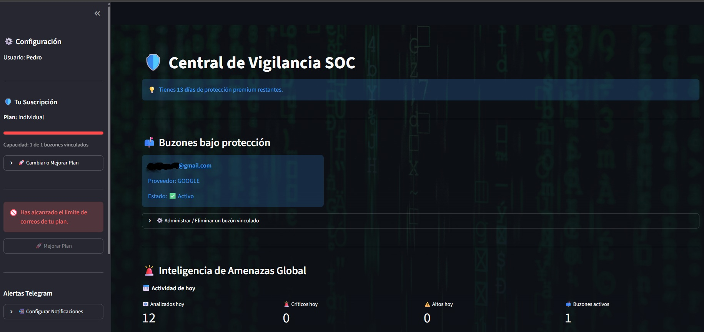
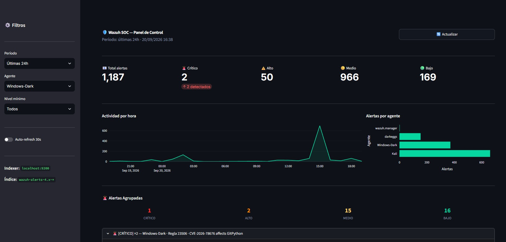
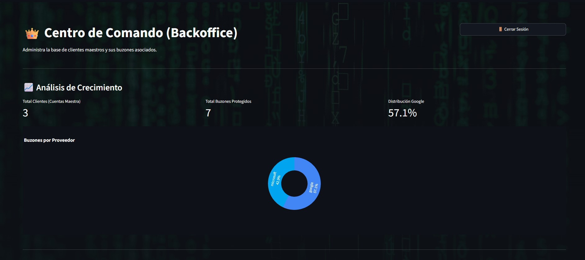
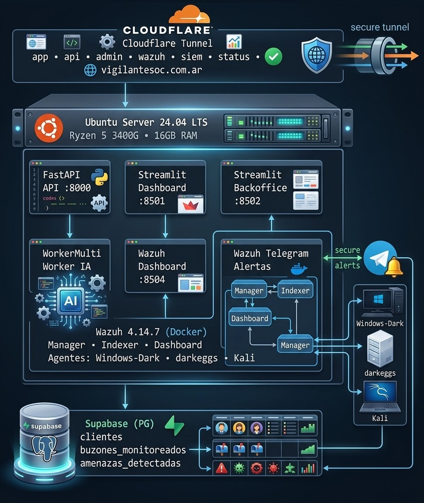

# 🛡️ Vigilante SOC

> **SaaS de monitoreo de amenazas por correo electrónico con IA e integración SIEM, construido y operado por un único desarrollador.**

Vigilante SOC es una plataforma de ciberseguridad que monitorea bandejas de entrada de Gmail y Outlook en tiempo real usando inteligencia artificial para detectar phishing, malware y amenazas por correo electrónico. Evolucionó desde un escáner básico de emails hasta un SOC doméstico completo con integración SIEM, alertas automáticas, dashboards multi-tenant y controles de acceso Zero Trust — todo corriendo en un servidor Ubuntu self-hosted.

---

## 📸 Capturas de pantalla

| Dashboard del Cliente | Panel Wazuh SOC | Backoffice Admin |
|:---:|:---:|:---:|
|  |  |  |
| Inteligencia de amenazas con alertas agrupadas | Alertas Wazuh en tiempo real con análisis IA | Panel de administración con gestión de suscripciones |

---

## 🏗️ Arquitectura General

<p align="center">
  
</p>


---

## ✨ Funcionalidades

### Detección de Amenazas por Email
- **Pipeline IA de doble modelo** — modelo rápido para clasificación inicial, escalado a modelo mayor para veredictos CRÍTICO/ALTO
- **Sistema de 4 niveles de severidad** — CRÍTICO / ALTO / MEDIO / BAJO con comportamiento de notificación diferenciado
- **Explicaciones en lenguaje humano** — cada alerta CRÍTICO/ALTO incluye una explicación en texto simple para el usuario final
- **Motor de análisis de links** — detecta acortadores de URL, typosquatting, URLs con IP directa, extensiones de archivo peligrosas
- **Reglas anti-falsos-positivos** — lista blanca de dominios oficiales, calibración balanceada del prompt
- **Soporte multi-proveedor** — Gmail (OAuth2 + Google API) y Outlook/Hotmail (Microsoft Graph + MSAL)
- **Gestión del ciclo de vida de tokens** — renovación proactiva, detección de rotación, notificaciones de vencimiento

### SaaS Multi-Tenant
- **Dashboard del cliente** — inteligencia de amenazas con alertas agrupadas (×N), gráfico de distribución de severidad, KPIs diarios e históricos
- **Backoffice admin** — control total: gestión de suscripciones, activación/suspensión de buzones, actualizaciones en cascada
- **Notificaciones Telegram** — alertas en tiempo real con correlación/deduplicación, 3 reportes diarios con tips de seguridad generados por IA
- **Autenticación segura** — contraseñas bcrypt, gestión de sesión, login con rate limiting (máx. 5 intentos)
- **2FA en backoffice** — Google Authenticator (TOTP)

### Integración SIEM (Wazuh)
- **Dashboard SOC Wazuh propio** — construido sobre el indexer OpenSearch, alertas en tiempo real, timeline por hora, desglose por agente
- **Motor de correlación de alertas** — deduplica eventos repetidos dentro de ventanas de TTL, agrupa por agente+regla
- **Normalización en 4 niveles** — CRÍTICO (≥12), ALTO (8-11), MEDIO (4-7 → resumen horario), BAJO (ignorado)
- **Análisis IA bajo demanda** — botón de análisis por alerta en el dashboard con Groq
- **Integración Telegram** — alertas inmediatas para ALTO/CRÍTICO, resúmenes horarios de MEDIO, heartbeat cada 3 horas

### Infraestructura y Seguridad
- **Cloudflare Tunnel + Zero Trust** — sin puertos expuestos, acceso con Google OAuth en paneles sensibles
- **Fail2ban** — protección contra brute force SSH
- **Cifrado Fernet** — todos los refresh tokens OAuth cifrados en reposo
- **Backups automáticos** — semanales por SCP a PC Windows + rclone a Google Drive
- **Política de retención de datos** — limpieza automática via RPC Supabase (BAJO/MEDIO >30d, ALTO/CRÍTICO >90d)
- **Endurecido con pentest** — 5 fases de pentest desde Kali Linux: puertos expuestos, headers HTTP faltantes, rate limiting, divulgación de banners, fuga en callbacks OAuth

---

## 🛠️ Stack Tecnológico

| Capa | Tecnología |
|------|-----------|
| **API Backend** | FastAPI + Uvicorn |
| **Workers de Email** | Python 3.12, Google API Client, MSAL |
| **IA / LLM** | Groq API (`openai/gpt-oss-20b` + `openai/gpt-oss-120b`) |
| **Dashboards** | Streamlit + Plotly |
| **PWA Móvil** | HTML/JS personalizado |
| **Base de Datos** | Supabase (PostgreSQL + Storage) |
| **SIEM** | Wazuh 4.14.7 (Docker single-node) |
| **Análisis de Links** | Motor propio `detector_links.py` |
| **Cifrado / Auth** | Fernet, bcrypt, TOTP |
| **Gestor de Procesos** | PM2 |
| **Proxy Inverso** | nginx |
| **Túnel / ZTA** | Cloudflare Tunnel + Cloudflare Access |
| **Alertas** | Telegram Bot API |
| **Reportes** | ReportLab (PDF) |
| **Backups** | SCP + rclone |

---

## 📁 Estructura del Proyecto

```
VigilanteSoc/
├── main.py                  # FastAPI — callbacks OAuth, endpoints API
├── dashboard.py             # Streamlit — dashboard de amenazas del cliente
├── backoffice.py            # Streamlit — panel admin con 2FA
├── WorkerMulti.py           # Worker de patrullaje (Gmail + Outlook)
├── detector_links.py        # Motor de análisis de URLs
├── wazuh_alertas.py         # Procesador de alertas Wazuh con IA + correlación
├── wazuh_dashboard.py       # Dashboard SOC Wazuh (powered by OpenSearch)
├── Llaves.py                # Utilidad generadora de claves Fernet
├── cloudflared_config.yml   # Enrutamiento Cloudflare Tunnel
└── .env                     # Secretos (nunca commitear)

~/wazuh-docker/
└── single-node/             # Stack Docker Compose de Wazuh
    ├── docker-compose.yml
    └── config/

~/wazuh_telegram/
└── wazuh_alertas.py         # Bridge standalone Wazuh → Telegram
```

---

## ⚙️ Servicios (PM2)

| Servicio | Puerto | Descripción |
|---------|--------|-------------|
| `vigilante-api` | 8000 | FastAPI — OAuth + webhooks |
| `Dashboard` | 8501 | Dashboard de amenazas del cliente |
| `Backoffice` | 8502 | Panel admin (protegido con 2FA) |
| `status-dashboard` | 8503 | Estado público del sistema |
| `wazuh-dashboard` | 8504 | Panel SOC de Wazuh |
| `Worker` | — | Patrullaje de emails (ciclo 10 min) |
| `wazuh-telegram` | — | Bridge de alertas Wazuh (ciclo 60s) |

---

## 🌐 Endpoints Públicos

| URL | Servicio |
|-----|---------|
| `app.vigilantesoc.com.ar` | Dashboard del cliente |
| `api.vigilantesoc.com.ar` | API REST |
| `admin.vigilantesoc.com.ar` | Backoffice (protegido ZTA) |
| `wazuh.vigilantesoc.com.ar` | Dashboard Wazuh SOC (protegido ZTA) |
| `siem.vigilantesoc.com.ar` | Dashboard nativo Wazuh (protegido ZTA) |
| `status.vigilantesoc.com.ar` | Estado del sistema |
| `m.vigilantesoc.com.ar` | PWA móvil |

---

## 🗄️ Esquema de Base de Datos (Supabase)

```sql
-- Cuentas maestras de clientes
CREATE TABLE clientes (
    id UUID PRIMARY KEY DEFAULT uuid_generate_v4(),
    nombre TEXT,
    email_principal TEXT UNIQUE NOT NULL,
    password_hash TEXT,
    plan_tipo TEXT DEFAULT 'Individual',
    limite_buzones INTEGER DEFAULT 1,
    estado_suscripcion TEXT DEFAULT 'inactivo',
    fecha_vencimiento TIMESTAMP WITH TIME ZONE,
    telegram_chat_id TEXT,
    telegram_bot_token TEXT
);

-- Buzones monitoreados (uno por cuenta OAuth)
CREATE TABLE buzones_monitoreados (
    id UUID PRIMARY KEY DEFAULT uuid_generate_v4(),
    cliente_id UUID REFERENCES clientes(id) ON DELETE CASCADE,
    email_cuenta TEXT NOT NULL,
    proveedor TEXT NOT NULL,           -- 'google' | 'microsoft'
    refresh_token_cifrado TEXT,        -- Cifrado con Fernet
    estado_proteccion TEXT DEFAULT 'inactivo',
    UNIQUE(cliente_id, email_cuenta)
);

-- Todos los correos analizados (no solo amenazas)
CREATE TABLE amenazas_detectadas (
    id UUID PRIMARY KEY DEFAULT uuid_generate_v4(),
    buzon_id UUID REFERENCES buzones_monitoreados(id) ON DELETE CASCADE,
    id_mensaje_correo TEXT NOT NULL,
    remitente TEXT,
    asunto TEXT,
    veredicto_ia TEXT NOT NULL,        -- CRÍTICO | ALTO | MEDIO | BAJO | ERROR_IA
    links_sospechosos TEXT,
    carpeta TEXT DEFAULT 'INBOX',
    fecha_analisis TIMESTAMP WITH TIME ZONE DEFAULT NOW(),
    UNIQUE(buzon_id, id_mensaje_correo)
);
```

---

## 🤖 Pipeline de IA
<p align="center">
  
</p>
---

## 🚀 Decisiones de Arquitectura

**¿Por qué self-hosted en vez de nube?**
La inestabilidad de red de Oracle Cloud causaba cortes frecuentes. Un servidor local con Cloudflare Tunnel da mejor uptime, cero costos de egress y control total sin dependencia de un proveedor de nube.

**¿Por qué Groq en vez de OpenAI?**
Velocidad y costo. El pipeline de triaje de doble modelo (modelo rápido primero → escalar solo cuando es necesario) mantiene los costos de inferencia mínimos sin sacrificar precisión.

**¿Por qué no exponer puertos directamente?**
Cloudflare Tunnel + Access elimina la superficie de ataque completamente. Sin puertos abiertos en el firewall, autenticación Zero Trust en paneles sensibles, sin necesidad de VPN.

**¿Por qué Fernet para cifrar tokens?**
Cifrado simétrico con ciphertext autenticado, implementado en la librería `cryptography` de Python. Simple de operar en solitario, seguro ante compromisos de la base de datos.

---

## 📈 Línea de Tiempo de Evolución

```
v0.1  Prototipo en laptop — escáner IMAP básico, almacenamiento en archivos
v0.2  Oracle Cloud — API + Supabase, soporte multi-usuario
v0.3  AWS EC2 — Docker, mayor confiabilidad
v0.4  Self-hosted Ubuntu — servidor local + Cloudflare Tunnel
v0.5  Integración SIEM — Wazuh, 3 agentes, alertas Telegram
v0.6  Endurecimiento de seguridad — pentest Kali, 2FA, ZTA, Fail2ban
v0.7  Mejoras SOC-Lab — motor de correlación, análisis IA,
       4 niveles de severidad, dashboard agrupado, panel Wazuh SOC
```

---

## 🔒 Notas de Seguridad

- Todos los refresh tokens OAuth están **cifrados con Fernet** antes de almacenarse
- El Backoffice requiere **TOTP (Google Authenticator)** además de contraseña
- **Cloudflare Access** protege el panel admin y el dashboard de Wazuh con Google OAuth
- **Fail2ban** monitorea SSH para detectar intentos de brute force
- **RLS activo** en todas las tablas de Supabase con políticas service_role
- El archivo `.env` **nunca se commitea** — usá el template de abajo

### Template del .env

```env
# Supabase
SUPABASE_URL=
SUPABASE_KEY=

# Cifrado Fernet
VIGILANTE_MASTER_KEY=
VIGILANTE_MASTER_KEY2=

# Google OAuth
GOOGLE_CLIENT_ID=
GOOGLE_CLIENT_SECRET=
GOOGLE_REDIRECT_URI=

# Microsoft OAuth
MICROSOFT_CLIENT_ID=
MICROSOFT_CLIENT_SECRET=
MICROSOFT_REDIRECT_URI=

# Telegram
TELEGRAM_ADMIN_CHAT_ID=
TELEGRAM_TOKEN_DEFAULT=

# IA
GROQ_API_KEY=

# Admin
BACKOFFICE_PASSWORD=
TOTP_SECRET=

# Dashboard Wazuh
DASHBOARD_URL=
```

### Requesitos del sistema.

```
fastapi
uvicorn
supabase
python-dotenv
cryptography
bcrypt
groq
httpx
msal
google-auth
google-auth-oauthlib
google-api-python-client
streamlit
pandas
plotly

```
## 👤 Autor

**Lic. Antonio Izzo**  
Buenos Aires, Argentina  
